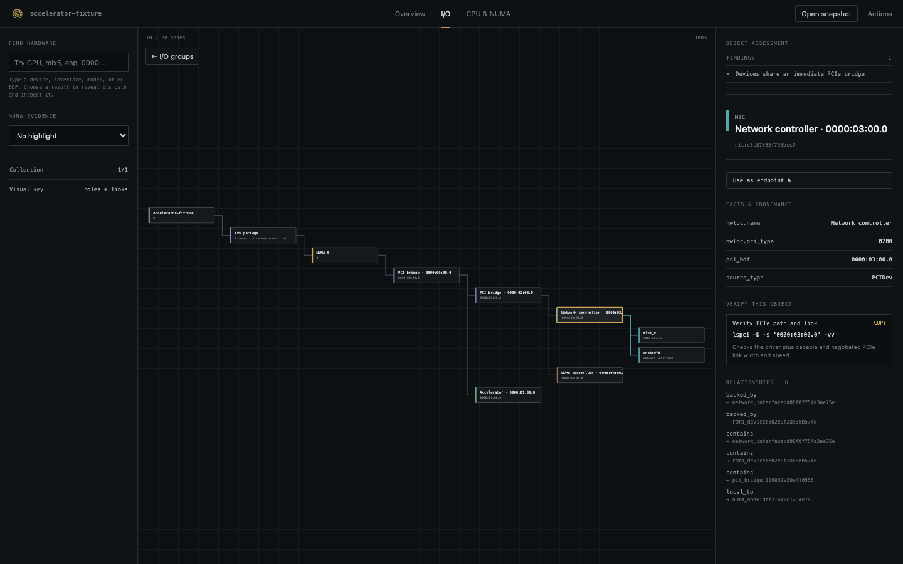

# Contour

Contour is a deterministic Linux system-topology explorer. It collects CPU, NUMA, PCIe, GPU, NIC, RDMA, and storage relationships, then opens a local browser UI for inspection, evidence-backed path dossiers, prioritized findings, provenance, and SVG/JSON export.



*A sanitized accelerator fixture with one PCIe branch open. Contour reveals the relevant graph progressively, then connects a selected device to exact evidence and verification commands.*

## Why Contour

`lstopo` is an excellent source of hardware topology, but its static whole-system output becomes difficult to investigate on dense machines. Contour keeps that evidence and changes how an engineer works with it.

| Static whole-system diagram | Contour |
| --- | --- |
| Shows the complete hierarchy at once | Starts with I/O or CPU/NUMA questions and reveals one branch at a time |
| Requires visual scanning for a device | Searches models, interfaces, RDMA names, and PCI BDFs |
| Primarily presents containment | Correlates PCI devices, netdevs, RDMA ports, NUMA evidence, and known paths |
| Produces a picture | Produces an evidence-backed route dossier with exact verification commands |

### Why it matters

- Reduces the time spent correlating `lstopo`, sysfs, `ip`, and `rdma` output during bring-up or incident investigation.
- Makes shared PCIe paths and NUMA placement visible without claiming that topology alone proves congestion.
- Gives engineers an inspectable snapshot they can hand to another person and reproduce offline.
- Turns missing data into an explicit collector result instead of silently treating “unknown” as “not present.”

### How it is built

- Replaceable Linux collectors gather raw observations from hwloc, sysfs, iproute2, and optional RDMA tooling.
- Normalization produces one versioned canonical topology schema; the UI never parses command-specific output.
- Stable physical identities, typed relationships, diagnostics, and per-fact provenance make every displayed claim traceable.
- Deterministic projection, hierarchy layout, and SVG rendering produce the same result from the same normalized snapshot.

## Quick start on Linux

Requirements: Node.js 22 or newer and `lstopo` from hwloc. `ethtool`, `rdma`, `devlink`, `nvidia-smi`, and `mlxlink` are optional evidence sources; missing tools do not prevent collection.

```bash
sudo apt install hwloc
git clone https://github.com/razorback4417/contour.git
cd contour
npm install
npm link
contour
```

Contour binds to `http://127.0.0.1:4177` and opens a browser when one is available. Press `Ctrl+C` to stop it. Run `contour doctor` if collection does not start.

## Mac to a remote Linux machine

Live collection runs on Linux. If the target can access GitHub, SSH to it and use the Linux quick start above.

If you need to clone on your Mac and copy the source to the target:

```bash
# On the Mac
git clone https://github.com/razorback4417/contour.git
rsync -az --exclude .git --exclude node_modules --exclude dist --exclude dist-cli contour/ user@host:~/contour/

# On the Linux target
ssh user@host
cd ~/contour
npm install
npm link
contour
```

Contour prints the exact tunnel command. Keep Contour running, then use a second Mac terminal:

```bash
ssh -N -L 4177:127.0.0.1:4177 user@host
```

Open `http://127.0.0.1:4177` on the Mac. The UI remains bound to the Linux machine's loopback interface and is not exposed to the network.

For later source updates, rerun the same `rsync` command and `npm install` on Linux. Build on Linux; do not copy `node_modules`, `dist`, or `dist-cli` from the Mac.

## Commands

```bash
contour                    # inspect this Linux machine
contour topology.json      # open a saved Contour snapshot
contour topology.xml       # open a saved lstopo XML capture
contour doctor             # check prerequisites
contour --help             # show normal usage
contour advanced           # show scripting commands
```

Mac and Windows can open saved XML or JSON snapshots, but live collection is Linux-only. One way to capture XML without installing Contour remotely is:

```bash
ssh user@host 'lstopo --whole-system --of xml -' > topology.xml
contour topology.xml
```

## Using the UI

- Start with **I/O paths** or **CPU & NUMA** instead of rendering the complete graph.
- Select a node to inspect exact facts, provenance, relationships, and a focused verification command.
- Open a summarized I/O branch from the selected node's right panel.
- Search by model, device class, interface, RDMA name, or PCI BDF.
- Choose endpoint A and endpoint B to highlight their known containment path.
- Inspect the path dossier for hop-by-hop identity, explicit NUMA evidence, scoped findings, uncertainty, and verification commands.
- Export the canonical snapshot or current deterministic SVG from the browser.

Edges represent observed or derived topology facts. When sources provide it, the inspector shows PCIe negotiated/capable width and speed, Ethernet link/FEC state, RDMA counters, driver health, and optional NVIDIA evidence. Counters and topology do not by themselves prove congestion; unknown information remains distinct from absent information.

## Development

```bash
npm install
npm test
npm run typecheck
npm run build
```

Use `npm run dev` for UI development. The durable topology contract and collector boundaries live in [`docs/SCHEMA.md`](docs/SCHEMA.md) and [`docs/COLLECTORS.md`](docs/COLLECTORS.md).

## Current limits

Live collection combines hwloc XML, Linux PCI/network/InfiniBand sysfs, iproute2, ethtool link and selected nonzero counters, RDMA device/link/statistics data, devlink port/health data, and optional NVIDIA XML/`mlxlink` evidence. Findings are deterministic checks over one snapshot, not proof of congestion or current failure. Direct NVML, NVMe subsystem enrichment, counter deltas, and fabric-wide topology remain planned. Some driver health, module, and `mlxlink` data may require permissions Contour does not request automatically.

Snapshots may contain identifying hardware or environment data such as hostnames, interfaces, PCI identifiers, GUIDs, serials, and source paths. Review them before sharing.

Licensed under the [Apache License 2.0](LICENSE).
