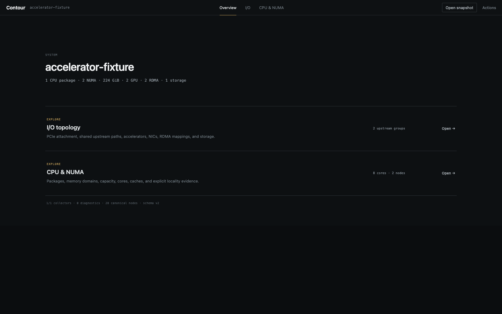
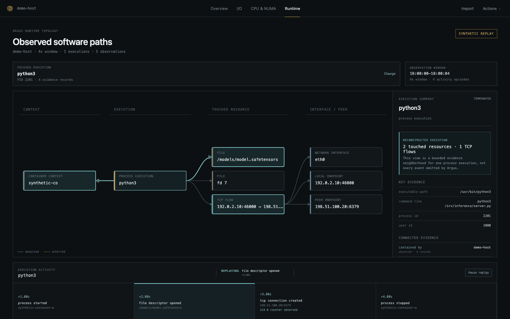

# Contour

Contour is an evidence-backed topology explorer with two separate workspaces:

| Workspace | Input | What it answers | Schema |
| --- | --- | --- | --- |
| **Physical topology** | Linux collectors, saved `lstopo` XML, or a Contour snapshot | How CPU, NUMA, PCIe, GPU, NIC, RDMA, and storage devices relate | `contour.topology/v2` |
| **Runtime evidence** | Argus JSONL or bounded ClickHouse windows | How processes, containers, files, TCP connections, endpoints, and interfaces relate over time | `contour.runtime/v1` |

The workspaces use separate inputs and schemas. Contour does not infer a
physical path from runtime activity. Runtime mode can replay a capture or read
ClickHouse without logging in to or installing anything on the monitored host.
The bundled example is synthetic; imported and live inputs retain their own
source label, versions, and normalization diagnostics.



*A sanitized accelerator fixture with one PCIe branch open. Contour reveals the relevant graph progressively, then connects a selected device to exact evidence and verification commands.*



*The bundled synthetic Argus replay. Contour reconstructs one process-centered software path, distinguishes observed from inferred relationships, and keeps the active evidence sequence visible below the graph.*

## What Contour helps answer

### Physical topology

- Where is a GPU, NIC, RDMA port, or storage device attached?
- Which PCIe and NUMA relationships are directly supported by host evidence?
- What exact command can another engineer run to verify the path?

Contour correlates `lstopo`, sysfs, `ip`, RDMA, and optional vendor evidence
without presenting topology as proof of congestion or root cause.

### Runtime evidence

- Which process execution touched a file or owned a TCP connection?
- What container and Linux namespace context did Argus observe?
- How did the evidence-backed software graph change during the selected window?

Contour turns separate Argus records into stable executions and relationships.
Each relationship remains linked to its source record and labeled as observed
or inferred.

Both workspaces preserve unknown information instead of treating it as absent.
The same normalized input always produces the same graph, so an investigation
can be exported, replayed, and handed to another engineer.

## Try Contour

Requirements for both workspaces: Node.js 22 or newer.

```bash
git clone https://github.com/razorback4417/contour.git
cd contour
npm install
npm link
```

### Replay the bundled Argus example

This works on Linux, macOS, and Windows:

```bash
contour runtime fixtures/argus/process-network-sequence.jsonl
```

### Inspect physical topology on Linux

```bash
sudo apt install hwloc
contour
```

`ethtool`, `rdma`, `devlink`, `nvidia-smi`, and `mlxlink` are optional evidence
sources. Missing optional tools do not prevent collection. For a Linux target
reached from another machine, see [Remote Linux collection](docs/REMOTE-LINUX.md).

Contour binds to `http://127.0.0.1:4177` and opens a browser when available.
Press `Ctrl+C` to stop it. Run `contour doctor` if collection does not start.

## Commands

```bash
contour                      # inspect this Linux machine
contour topology.json        # open a saved Contour snapshot
contour topology.xml         # open a saved lstopo XML capture
contour runtime argus.jsonl  # replay an Argus activity capture
contour runtime --clickhouse # read the latest Argus events from ClickHouse
contour doctor               # check prerequisites
contour --help               # show normal usage
contour advanced             # show scripting commands
```

Mac and Windows can open saved XML or JSON snapshots, but live collection is Linux-only. One way to capture XML without installing Contour remotely is:

```bash
ssh user@host 'lstopo --whole-system --of xml -' > topology.xml
contour topology.xml
```

## Using the UI

### Physical topology

- Start with **I/O paths** or **CPU & NUMA** instead of rendering the complete graph.
- Select a node to inspect exact facts, provenance, relationships, and a focused verification command.
- Open a summarized I/O branch from the selected node's right panel.
- Search by model, device class, interface, RDMA name, or PCI BDF.
- Choose endpoint A and endpoint B to highlight their known containment path.
- Inspect the path dossier for hop-by-hop identity, explicit NUMA evidence, scoped findings, uncertainty, and verification commands.
- Export the canonical snapshot or current deterministic SVG from the browser.

Edges represent observed or derived physical facts. When sources provide it,
the inspector shows PCIe negotiated/capable width and speed, Ethernet link/FEC
state, RDMA counters, driver health, and optional NVIDIA evidence. Counters and
topology do not by themselves prove congestion; unknown information remains
distinct from absent information.

### Runtime evidence

The Runtime workspace turns separate Argus events into a process-centered
software flow. It shows container context, touched files, TCP connections,
local interfaces, peer endpoints, and the evidence sequence behind the graph.
Process evidence includes the current working directory and Linux namespace
identifiers when Argus supplies them. Relationships are labeled as observed or
inferred. If process identity is ambiguous, Contour reports that ambiguity
instead of merging records by PID.

An endpoint remains an IP and port unless an evidence source explicitly
identifies it. Contour does not guess application or service names from an
address.

Runtime captures can be replayed from JSONL or read live from bounded
ClickHouse windows. The UI supports process search, replay, earlier and newer
windows, UTC jumps, and a searchable evidence ledger. Search follows connected
evidence, so a container ID, touched path, or endpoint can locate its process.
Replay can be paused or restarted, and exported runtime JSON can be reopened
offline. The compatibility panel reports observed Argus versions and
normalization diagnostics for the current window.

To read real events already stored in the receiver's ClickHouse instance, run
Contour on that machine or through a tunnel:

```bash
set -a && . deploy/argus-observability/.env && set +a
contour runtime --clickhouse
```

See the [Argus receiver guide](deploy/argus-observability/README.md) for initial
OTLP, ClickHouse, and sender setup. Contour does not require SSH access to the
monitored workload.

`CLICKHOUSE_URL` defaults to `http://127.0.0.1:8123`; the database defaults to
`otel`. The live reader refreshes the latest 500 stored bodies every two
seconds, restores chronological order, and passes the raw JSON records to the
same Argus normalizer as JSONL replay. The focused flow animates only
relationships backed by the active observation; it does not simulate packets.

## Development

```bash
npm install
npm run check
```

The individual validation commands are:

```bash
npm test
npm run typecheck
npm run build
```

Use `npm run dev` for UI development.

Documentation is split by ownership:

- [`docs/SCHEMA.md`](docs/SCHEMA.md): physical topology schema;
- [`docs/COLLECTORS.md`](docs/COLLECTORS.md): physical Linux evidence sources;
- [`docs/REMOTE-LINUX.md`](docs/REMOTE-LINUX.md): run collection on a remote Linux target;
- [`docs/RUNTIME.md`](docs/RUNTIME.md): Argus normalization, replay, and runtime boundaries.
- [`deploy/argus-observability/README.md`](deploy/argus-observability/README.md): OTLP and ClickHouse receiver setup.

## Current limits

Physical collection combines hwloc XML, Linux PCI/network/InfiniBand sysfs,
iproute2, ethtool, RDMA, devlink, and optional NVIDIA evidence. Findings are
checks over one snapshot, not proof of congestion or failure. Direct NVML,
NVMe subsystem enrichment, physical link counter deltas, and fabric-wide
topology remain planned.

Runtime evidence is limited to the events Argus exports in the selected window.
It can reconstruct software communication paths, but not switch hops, VLANs,
routing intent, DNS names, or Kubernetes service identity. Those require
separate remote evidence sources. Replay animation shows evidence progression,
not captured packets.

Snapshots may contain identifying hardware or environment data such as hostnames, interfaces, PCI identifiers, GUIDs, serials, and source paths. Review them before sharing.

Licensed under the [Apache License 2.0](LICENSE).
